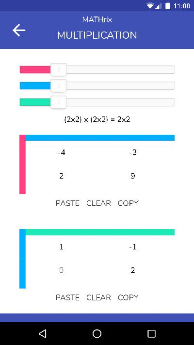
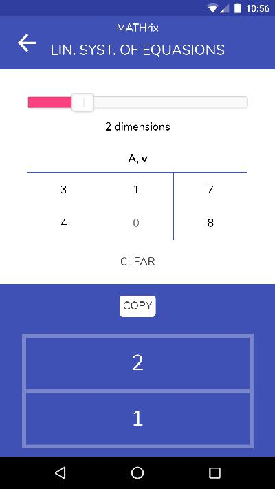
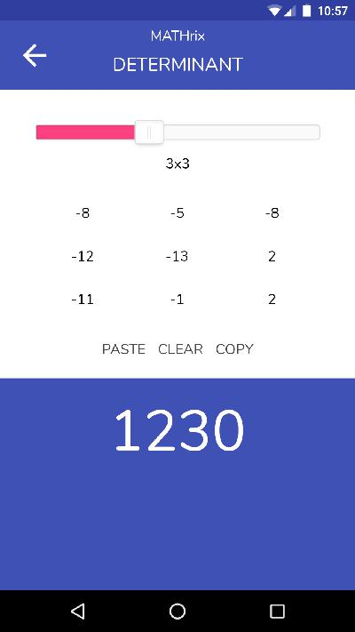

# mathrix

_Mathrix_ is a free, open source, beautiful and intuitive calculator for simple linear algebra problems. It is designed to help students check their homework and to deepen their understanding of math.

[Start Mathrix in your Browser][browser]

## Features

- Instant calculations for all operations
- Colorful, intuitive design
- Includes support for:
	- Matricies: Multiplication, Determinant, Inverse, Linear Systems of Equations
	- Vectors: Lengths, Dot Products, Vector Products
	- Random Number Generation
	- Advanced Copy/Paste

## Installation

Mathrix is available as an app on [Google Play][playstore] and for your [Browser][browser]. You can also build it from source: Make sure you have [Git][git] and [Sass][sass] installed. Then, run:

	> git clone https://github.com/sidneyneffe/mathrix
	> sass --watch sass:style
	> open index.html

I use [Apache Cordova][cordova] to generate the `apk` file.

## Screenshots

	
	
	

## About

Created in 2017 by Sidney Neffe.

Contains around 2,000 lines of code.

[browser]: http://sidneyneffe.com/projects/mathrix/app/
[playstore]: https://play.google.com/store/apps/details?id=de.sjnsoft.mathrix
[cordova]: https://cordova.apache.org/
[sass]: https://sass-lang.com/
[git]: https://git-scm.com/
